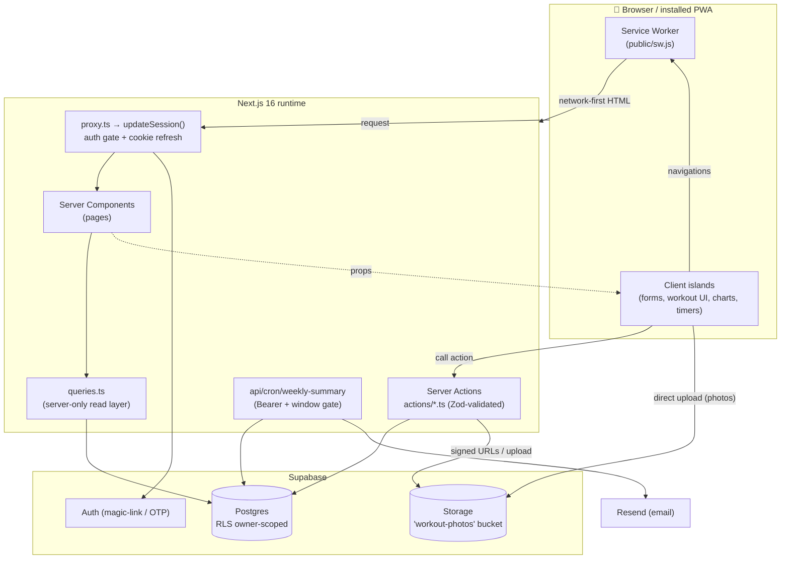
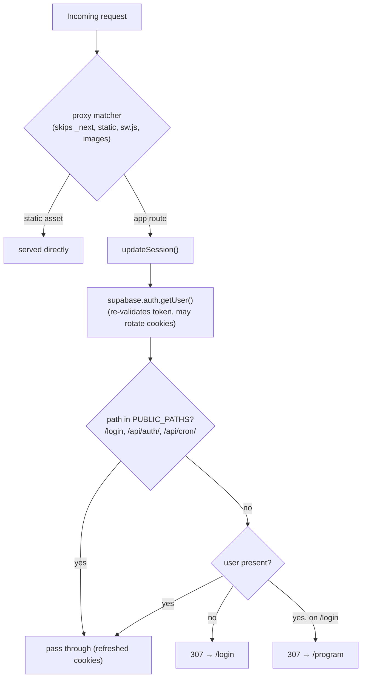
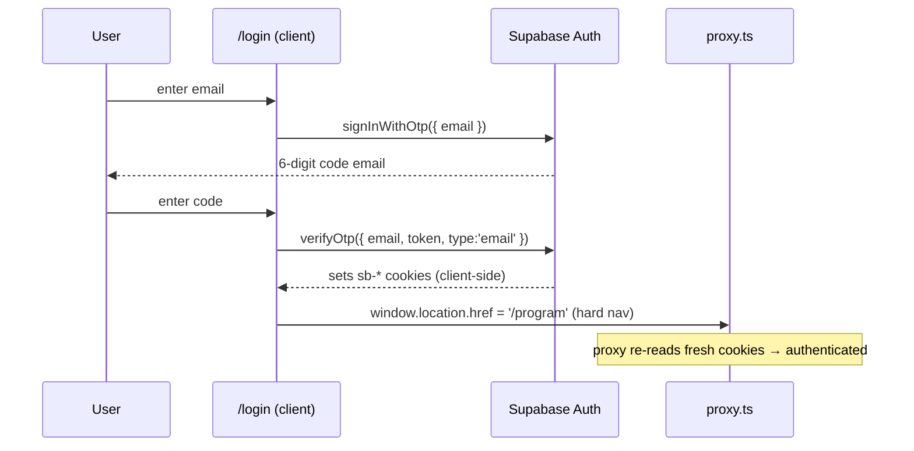
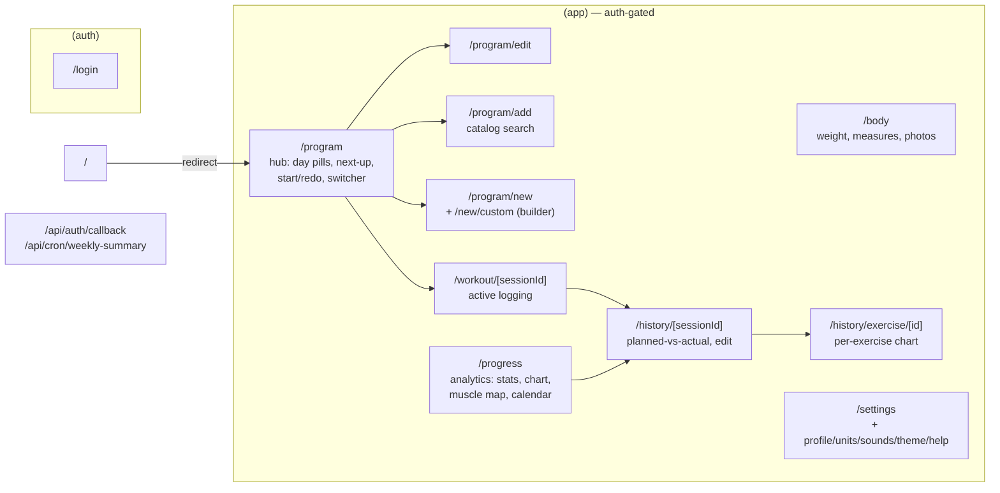
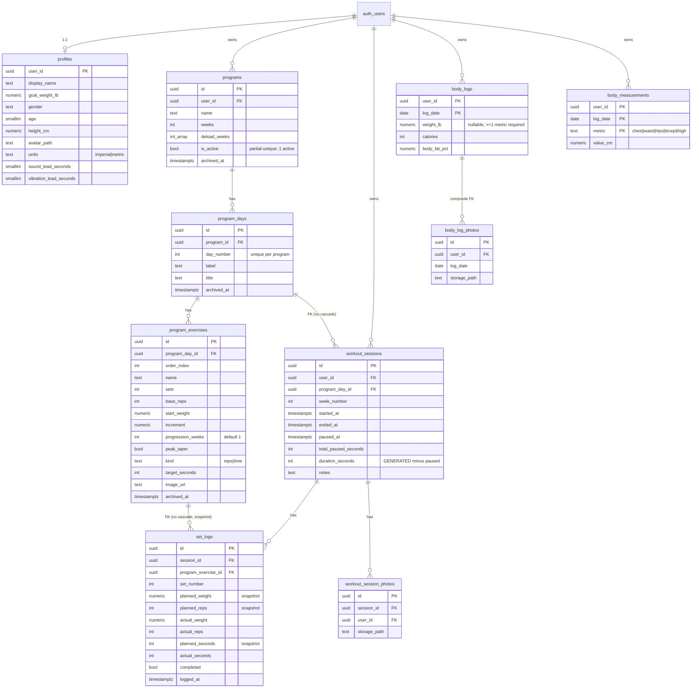
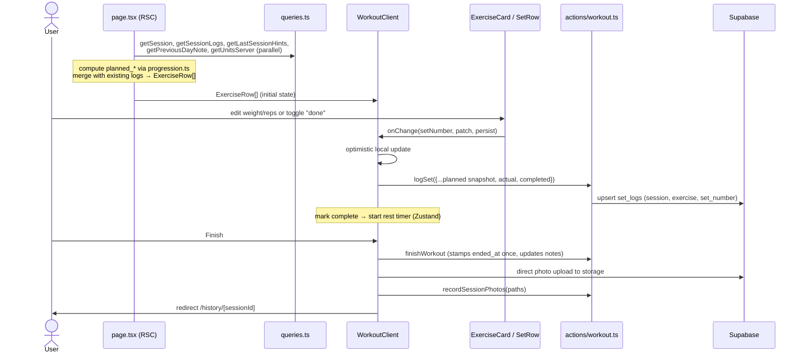
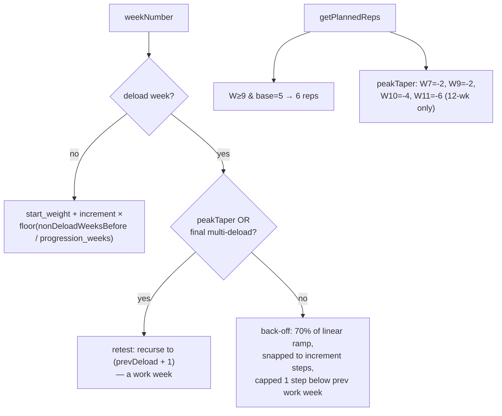
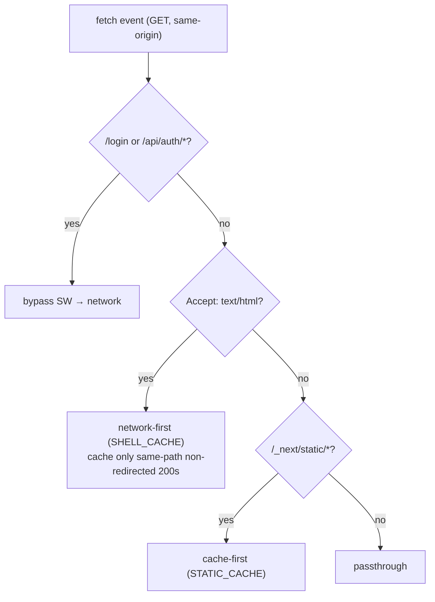
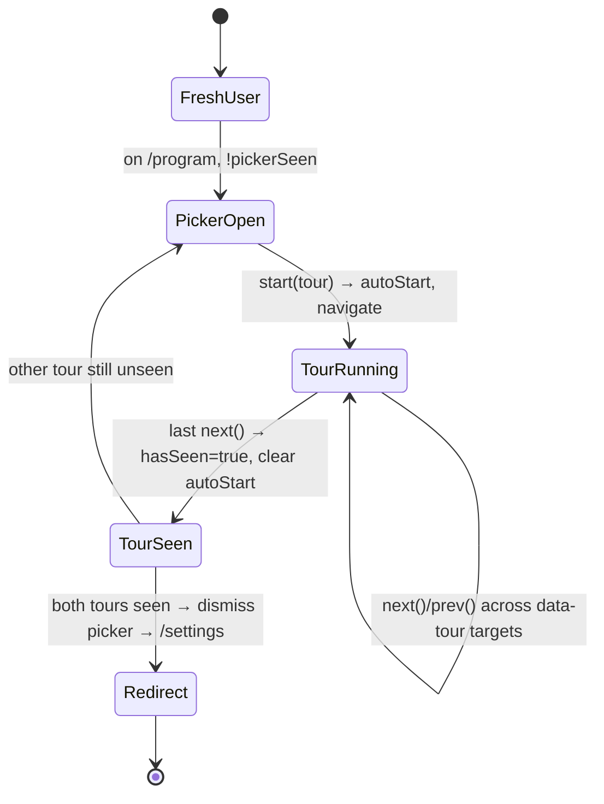

# Trainr — Architecture

A mobile-first PWA for logging strength programs at the gym. Single user today, multi-user-ready (RLS on every table). This document is the map of how the pieces fit together; for day-to-day conventions and the "don't" list, see [`CLAUDE.md`](../CLAUDE.md).

> Diagrams below are [Mermaid](https://mermaid.js.org/) and render on GitHub. If you're reading in a plain editor, the fenced ```mermaid``` blocks are the source.

---

## 1. Stack at a glance

| Layer | Choice | Notes |
|---|---|---|
| Framework | **Next.js 16** (App Router, Turbopack) | ⚠️ Next 16 renamed `middleware.ts` → **`proxy.ts`**. Read `node_modules/next/dist/docs/` before assuming older idioms. |
| Language | TypeScript (strict), `src/` dir | `npm run typecheck` is clean. |
| UI | React 19 + **Tailwind v4** (`@theme`) | Hand-rolled primitives, no shadcn. `lucide-react` icons. |
| Data | **Supabase** Postgres + Auth (magic-link / OTP) | RLS on every table. `@supabase/ssr ^0.10` for cookie handling. |
| Validation | **Zod** | Every server-action input is parsed. |
| Charts | **Recharts** | Per-exercise progress, body trends, workout-count bars. |
| Client state | **Zustand** (persisted) | Rest timer + onboarding/tutorial only. |
| Email | **Resend** + `@react-email` | Weekly summary, triggered by GitHub-Actions cron. |
| PWA | Hand-rolled | `manifest.ts`, `public/sw.js`, prod-only SW registration. |

`TanStack Query` is in `package.json` but **unused** — RSC + server actions cover everything.

---

## 2. High-level architecture



**Two rules hold the system together:**

1. **Pages never query Supabase directly.** Reads go through [`src/lib/queries.ts`](../src/lib/queries.ts) (`import "server-only"`); writes go through Zod-validated server actions in [`src/app/actions/`](../src/app/actions). There is no REST/GraphQL layer.
2. **RLS is the only tenant boundary.** Most queries and mutations operate by row id with *no* explicit `user_id` filter — owner-scoped policies (`auth.uid() = user_id`, or `EXISTS`-joins up to `programs.user_id`) enforce isolation. This is intentional and load-bearing, not an oversight.

---

## 3. Authentication & request lifecycle

There is **one** auth gate: [`src/proxy.ts`](../src/proxy.ts) → `updateSession()` in [`src/lib/supabase/middleware.ts`](../src/lib/supabase/middleware.ts). (The `(app)` layout is presentational — it does **not** re-check auth.)



**Login flow** (OTP-code based, not link-click):



A second path exists for magic-link/PKCE: `GET /api/auth/callback?code=…` → `exchangeCodeForSession` → redirect to `?next` (default `/program`). The live UI uses code entry.

**Trust tiers** — two distinct Supabase clients:

| Client | Where | Scope |
|---|---|---|
| Cookie-bound anon | `client.ts` (browser), `server.ts` (RSC/actions), `middleware.ts` (proxy) | RLS-enforced as the logged-in user |
| Service-role admin | `weekly-summary.ts` `createAdminClient()`, `profile.ts` `deleteAccount` | Bypasses RLS; **server-only**, never shipped to the client. Cron route is guarded by a `CRON_SECRET` Bearer header. |

---

## 4. Route map



Bottom nav (4 tabs): **Program · Progress · Body · Settings**. Auto-hidden on `/workout/*` and `/program/edit` so the action footer isn't covered. There is **no `/today` route** (removed; `/program` absorbed it) and **no `/calendar`** (the month grid lives inside `/progress`).

---

## 5. Data model (ER)

All tables are RLS-owner-scoped. Soft-delete via `archived_at` on `programs`, `program_days`, `program_exercises`.



**Load-bearing schema facts:**

- **`set_logs.planned_*` and `planned_seconds` are snapshotted at log time.** Changing the program later never rewrites history. The FK to `program_exercises` is **non-cascading** — you can't hard-delete an exercise once a log references it (hence soft-delete).
- **`workout_sessions.program_day_id` FK is non-cascading**, so `/history/[sessionId]` resolves day → parent program through the FK chain (`getSessionContext`) even for archived/inactive programs.
- **`duration_seconds` is a generated column**, redefined once (`pause_session.sql`) to subtract `total_paused_seconds`: `greatest(epoch(ended_at - started_at) - total_paused_seconds, 0)`.
- **`programs_one_active_per_user`** is a partial unique index (`user_id WHERE is_active AND archived_at IS NULL`). Every promotion path (`seedPresetProgram`, `createBlankProgram`, `setActiveProgram`, `archiveProgram`) **demotes the current active program first** in the same call, or the index rejects the write.
- **One private storage bucket** (`workout-photos`) holds three path families, RLS-gated on the first folder segment = `auth.uid()`:
  - `{uid}/{sessionId}/{uuid}.ext` — workout-finish photos
  - `{uid}/body/{date}/{uuid}.ext` — body progress photos
  - `{uid}/profile/{uuid}.ext` — avatar
- **Two RPCs** (atomic, to dodge read-compute-write races): `swap_day_order(p_day_a, p_day_b)` and `resume_session(session_id)`.

### Migration history

16 migrations, additive. Worth knowing:

| Migration | What it adds |
|---|---|
| `20260426` init | 5 core tables, RLS, indexes, generated `duration_seconds` |
| `20260427` ×3 | `image_url`; `archived_at` on exercises; `workout_session_photos` + `body_logs` + storage bucket |
| `20260428` programs_editing | `is_active` + `archived_at` on programs, `archived_at` on days, partial unique index |
| `20260430` + two empty | `swap_day_order` RPC (two later same-name files are **empty no-ops**) |
| `20260502` profiles | `profiles` (display_name) |
| `20260503` progression_weeks | per-exercise `progression_weeks` (1–8) |
| `20260504` pause_session | `paused_at`, `total_paused_seconds`, redefined `duration_seconds`, `resume_session()` |
| `20260516` cardio | `kind`/`target_seconds` + `planned_seconds`/`actual_seconds` + cardio backfill |
| `20260519` peak_taper | `peak_taper` boolean |
| `20260528` body_goals_and_photos | `goal_weight_lb`, `body_fat_pct`, `body_log_photos` |
| `20260529` ×2 | `body_measurements` table **and** profile/settings columns — ⚠️ **share the same timestamp** |

> ⚠️ Two migrations carry `20260529000000` and two are empty `;` placeholders. See [`CODE_AUDIT.md`](./CODE_AUDIT.md) §Migrations. They're harmless on the already-applied DB but a hazard for fresh environments.

---

## 6. Workout logging flow

The most stateful screen. A server component snapshots the plan; a client island owns all live edits.



**Three independent timers** coexist (don't conflate them):

| Timer | Where | Persists across nav? |
|---|---|---|
| Rest timer | Zustand store (`stores/rest-timer.ts`), dual-mount `RestTimerBar` | ✅ yes (localStorage) |
| Per-set time-attack countdown | local state in `TimeSetInputRow` | ❌ no — lost on unmount |
| Elapsed-session clock | `useState` in `WorkoutClient` (1s interval) | n/a (recomputed from `started_at`) |

Finish is a **two-phase commit**: `finishWorkout` first (durable `ended_at` + notes, idempotent), then best-effort photo upload + `recordSessionPhotos`. Photo failure keeps the workout saved and offers retry/skip.

> A mid-workout drag-reorder writes `program_exercises.order_index` via `setExerciseOrder` — it **permanently changes the program**, not just this session. The merge-under-drift logic keeps a mid-workout-added exercise from being dropped.

---

## 7. Progressive overload model

Lives in [`src/lib/progression.ts`](../src/lib/progression.ts). Pure functions, recomputed at render time in 4 RSC pages (workout, history detail, program, program/edit). **This is not the same as `set_logs.planned_*`**, which are snapshotted at log time.



- Week 1 = baseline; each non-deload week adds `increment` (paced by `progression_weeks`).
- Deload = 70% back-off, **except** the final deload of a multi-deload program and `peak_taper` exercises, which *retest* the previous block's peak.
- `getPlannedSeconds` is a passthrough (time exercises don't progress).

> ⚠️ `peak_taper` rep cuts are hardcoded to weeks 7/9/10/11 (12-week assumption) while the weight taper is week-relative. See [`CODE_AUDIT.md`](./CODE_AUDIT.md). **Don't change this math without flagging** — Rahul has explicit weekly expectations.

---

## 8. Progress / analytics & timezone strategy

`/progress` is read-only. The spine is a pure window function.

```mermaid
flowchart LR
    SP["searchParams<br/>range + anchor"] --> PR["parseRange / parseAnchor"]
    PR --> LO["Last tab? → getLatestSessionDateKey(tz)"]
    LO --> CW["computeProgressWindow<br/>→ startKey, endKey, buckets, label, prev/next"]
    CW --> GP["getProgressForRange"]
    GP --> S1["fetch sessions in ±1-day UTC window"]
    S1 --> RF["re-filter by dateKeyInTz into [startKey,endKey]"]
    RF --> S2["fetch set_logs for surviving session ids"]
    S2 --> AGG["totals + per-bucket counts + muscle-group tallies"]
```



**Timezone invariant** (the thing that makes calendar math correct regardless of server TZ):

- DB stores UTC. A client-set `tz` cookie (`tz-init.tsx`) drives `dateKeyInTz` (Intl `en-CA` → `YYYY-MM-DD`).
- Range queries **pad ±1 UTC day** then **re-filter in JS** by the user-TZ date key. All calendar arithmetic uses UTC-midnight `Date` carriers as a TZ-neutral spine.
- A session counts as "activity" when it's **not a rest-day skip** (`is_rest_skip = false`). Rest-day skips are written by `skipRestDay` with `is_rest_skip = true` and excluded from streaks/progress/calendar. *(Earlier this was inferred from `duration_seconds = 0`, which could collide with a real zero-duration workout — replaced by the explicit `is_rest_skip` column in migration `20260530000000`.)*

Muscle map: `exercises-catalog.json` primary muscles → `CATALOG_TO_TOP_LEVEL` (8 groups) → `MUSCLE_TO_GROUP` (vendored `react-body-highlighter` polygons) → SVG heat overlay (opacity scales by set count).

---

## 9. Body tracking

Canonical units in the DB: **lb** (weight), **cm** (circumference). Conversion happens only at the edge, driven by the `units` cookie + `MetricConfig` registry (`body-metrics.ts`).

- **Two separate tables**: `body_logs` (one row/day shared by weight + bodyfat + calories; any one of them is enough — a `num_nonnulls(...) > 0` CHECK just forbids a fully empty row) and `body_measurements` (circumferences, decoupled so a tape-measure day needs no weigh-in).
- **Two photo systems share one bucket**: `workout_session_photos` (per session) and `body_log_photos` (per body-log date, composite FK requires a `body_logs` row first).
- Trend math (`body-stats.ts`): EMA smoothing (α by range), 7-day average, weekly rate from the EMA tail, linear goal-date projection (null unless trending toward goal).

---

## 10. PWA & service worker



- **HTML is network-first** so a deploy never serves a stale shell referencing purged `/_next` chunk hashes (which would 404 and break client nav). The cache is the offline fallback only.
- **Hashed static assets are cache-first** (immutable URLs).
- Auth paths bypass the SW so cookies/redirects always reach the network. HTML is only cached when the final URL path matches the request path — prevents a login-redirect from poisoning a page's cache key.
- `VERSION = "v4"` gates cache cleanup on `activate`. SW registers **in production only**.

---

## 11. Onboarding / tutorial state machine



State in `stores/tutorial.ts` (Zustand + persist, `version=3` with a `migrate()` chain). Only `pickerSeen` + per-tour `hasSeen` persist; `step`/`autoStart` are ephemeral (`partialize`) so a mid-tour reload can't resurrect an auto-fire. Replayable from Settings → Help.

---

## 12. Design system

Tokens in [`globals.css`](../src/app/globals.css) under Tailwind v4 `@theme`:

- **Surfaces** — `--color-surface` / `-hover` / `-subtle`
- **Borders** — `--color-border` / `-strong`
- **Foreground** — `--color-foreground` / `-muted` (single muted tier; the dark palette has no contrast headroom for a third)
- **Focus ring** — `--focus-ring-width` / `-offset` / `-color` (refs `--color-accent`)
- **Accent** — `--color-accent`, switched by `[data-theme]` across 5 themes (lime/sky/amber/violet/rose). The accent cookie is read SSR in the root layout to avoid FOUC.

Prefer `bg-surface` / `border-border` / `text-foreground-muted` over raw `neutral-*` in new code. Migration is per-screen; `/program`, `/progress`, bottom-nav are migrated, others partially. **Never hardcode accent/focus values** — reference the CSS vars so theme switching keeps working.

---

## 13. Key invariants & conventions (quick reference)

1. Reads → `queries.ts` (`server-only`); writes → Zod-validated `actions/*.ts`. No API layer.
2. RLS is the only tenant boundary; most writes carry no explicit `user_id`.
3. `set_logs.planned_*` are snapshotted at log time — don't change without flagging.
4. Promote a program → demote the current active one first (partial unique index).
5. `order_index` rewrites use a two-phase OFFSET pass (collision-safe even without a unique constraint).
6. Time: store UTC, derive user-TZ keys via `dateKeyInTz`, pad ±1 day then re-filter.
7. Rest-day skips are flagged by `workout_sessions.is_rest_skip`, not inferred from `duration_seconds`.
8. A11y baseline: pinch-zoom stays enabled, every interactive element gets a `:focus-visible` ring (via `--focus-ring-*`), bottom nav has `aria-label`/`aria-current`, skip-to-main link.

---

## 14. Known limitations

Tracked in [`CLAUDE.md`](../CLAUDE.md) (offline write queue deferred, no cancel-session UI, mid-workout exercise-add only affects future sessions, max 2 programs, PWA shell-caching only) and the prioritized findings in [`CODE_AUDIT.md`](./CODE_AUDIT.md).
